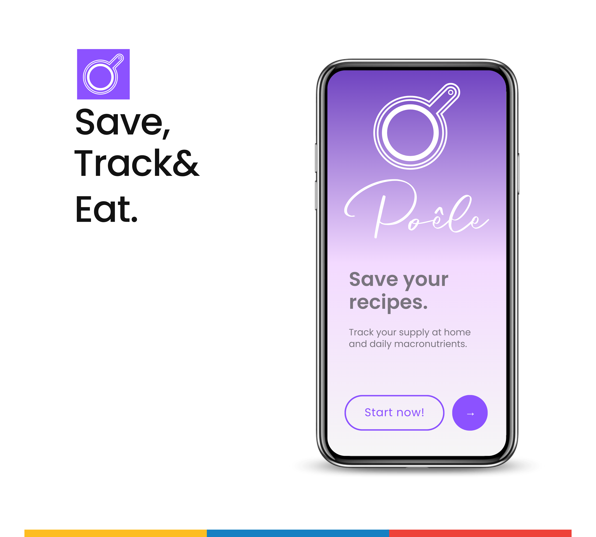
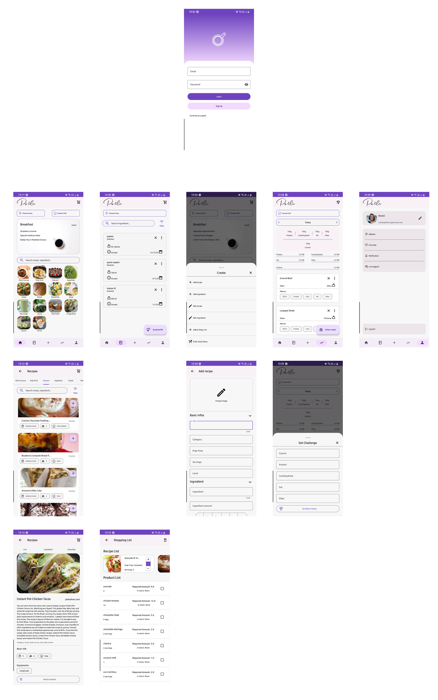
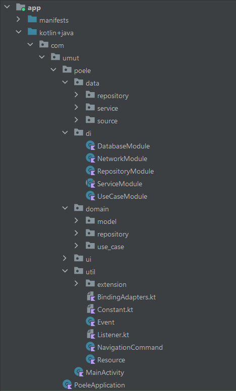
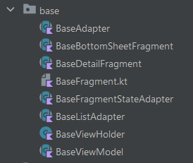
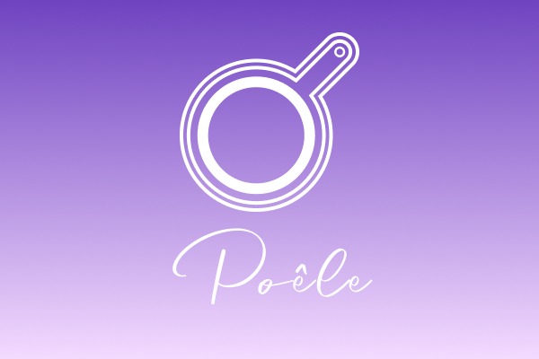




Poele App
===========

**Poele** is an Android app built entirely with Kotlin. It follows Android design and development best practices which I learned and intended to be an intance to show my skills.

The app is currently in development. There is no variant available in Play Store. However the libraries, structures and design architecture I learned have been implemented into the application at least once feature.

# Features

**Poele** was developed for recipe archive, learn new recipes also track your food stock in house. In addition to these you can track your daily macronutrients. Add, delete and edit recipes and stock products. Create a shop list. Add recipes to the list and their ingredients automatically added to your shop list. You can see amount required for the recipe and your stock amount. That way how much amount you need to buy that ingredient can be detected.

## Screenshots



## Screenshots (Whole App)

<p align="center">  

  
  
  
  
  
  
  
  
  
  
  
  
  
  
  
  
  
  


</p>

<br>
<br>

# Development Environment

**Poele** uses the Gradle build system and can be imported directly into Android Studio (make sure you are using the latest stable version available [here](https://developer.android.com/studio)). 

The `debug` and `release` build variants can be built and run.

Once you're up and running, you can refer to the learning journeys below to get a better
understanding of which libraries and tools are being used, the reasoning behind the approaches to
UI, architecture and more, and how all of these different pieces of the project fit
together to create a complete app.

# Architecture

The **Poele** app follows the **MVVM** (Model-View-ViewModel) architectural design pattern and **Clean Architecture** design pattern. 


# Build

The app contains the usual `debug` and `release` build variants. 

# UI
The app was designed using [Material 3 guidelines](https://m3.material.io/). Learn more about the design process and 
obtain the design files in the [Poele App Material 3 Case Study](https://www.figma.com/community/file/1326914116467428271/poele-app-material-3-case-study).

The Screens and UI elements are built entirely using XML.

The app has one theme: 

- Default theme - uses predefined colors when dynamic color is not supported
# Package Structure
Package structure of the project designed in the light of MVVM with Clean Architecture.
- Data
- Domain
- Dependency Injection
- UI
- Util


# Base Classes
To prevent boilerplate code in the project base classes implemented to the code.
- BaseFragment
- BaseViewModel
- BaseAdapter
- BaseListAdapter
- BaseBottomSheetFragment
- BaseFragmentStateAdapter
- BaseViewHolder



# Tech stack & Open-source libraries
- Minimum SDK level 21
- 100% [Kotlin](https://kotlinlang.org/) based + [Coroutines](https://github.com/Kotlin/kotlinx.coroutines), [Flow](https://developer.android.com/kotlin/flow) and [LiveData](https://developer.android.com/topic/libraries/architecture/livedata)
- [Android Architecture Components](https://developer.android.com/topic/libraries/architecture) - Collection of libraries that help you design robust, testable, and maintainable apps.
  -  A single-activity architecture, using the [Navigation](https://developer.android.com/guide/navigation) to manage transactions.
  - [Lifecycle](https://developer.android.com/topic/libraries/architecture/lifecycle) - perform an action when lifecycle state changes
  - [ViewModel](https://developer.android.com/topic/libraries/architecture/viewmodel) - Stores UI-related data that isn't destroyed on UI changes. 
  - [UseCases](https://developer.android.com/topic/architecture/domain-layer) - Located domain layer that sits between the UI layer and the data layer. 
  - [Repository](https://developer.android.com/topic/architecture/data-layer) - Located in data layer that contains application data and business logic.
- [Android Hilt](https://developer.android.com/training/dependency-injection/hilt-android) - Dependency Injection Library
- [Retrofit](https://square.github.io/retrofit/) A type-safe HTTP client for Android and Java
- [OkHttp](https://square.github.io/okhttp/) An HTTP client that efficiently make network requests
- [Room](https://developer.android.com/jetpack/androidx/releases/room) The Room persistence library provides an abstraction layer over SQLite to allow for more robust database access while harnessing the full power of SQLite.
- [Coil](https://coil-kt.github.io/coil/) An image loading library for Android backed by Kotlin Coroutines
- [SplashScreen](https://developer.android.com/develop/ui/views/launch/splash-screen) SplashScreen API lets apps launch with animation, including an into-app motion at launch, a splash screen showing your app icon, and a transition to your app itself.
- [Moshi](https://github.com/square/moshi) Moshi is a modern JSON library for Android, Java and Kotlin. It makes it easy to parse JSON into Java and Kotlin classes.
- [Firebase Auth](https://firebase.google.com/docs/auth) Firebase Authentication provides backend services, easy-to-use SDKs, and ready-made UI libraries to authenticate users to your app.
- [SDP](https://github.com/intuit/sdp) An android lib that provides a new size unit - sdp (scalable dp). This size unit scales with the screen size. It can help Android developers with supporting multiple screens.
- [Material Design 3](https://m3.material.io/) is the latest version of Google’s open-source design system.
# Dependency

 ```
   dependencies {  
   
// Core Libraries  
implementation 'androidx.core:core-ktx:1.12.0'  
implementation 'androidx.appcompat:appcompat:1.6.1'  
implementation 'com.google.android.material:material:1.11.0'  
implementation 'androidx.constraintlayout:constraintlayout:2.1.4'  
implementation 'androidx.recyclerview:recyclerview:1.3.2'  

// MVVM  
implementation "androidx.lifecycle:lifecycle-livedata-ktx:2.6.2"  
implementation "androidx.lifecycle:lifecycle-viewmodel-ktx:2.6.2"  
implementation "androidx.lifecycle:lifecycle-viewmodel-savedstate:2.6.2"  
implementation "androidx.lifecycle:lifecycle-extensions:2.2.0"  
implementation "androidx.lifecycle:lifecycle-runtime-ktx:2.6.2"  

// Navigation Components  
implementation "androidx.navigation:navigation-fragment-ktx:2.7.6"  
implementation "androidx.navigation:navigation-ui-ktx:2.7.6"  
implementation "androidx.navigation:navigation-dynamic-features-fragment:2.7.6"  

// Splash Screen  
implementation "androidx.core:core-splashscreen:1.0.1"  

// SDP - SSP  
implementation "com.intuit.sdp:sdp-android:1.1.0"  
implementation "com.intuit.ssp:ssp-android:1.1.0"  

// Retrofit  
implementation "com.squareup.retrofit2:retrofit:2.9.0"  
implementation "com.squareup.retrofit2:converter-gson:2.9.0"  
implementation "com.squareup.okhttp3:okhttp:5.0.0-alpha.2"  
implementation "com.squareup.okhttp3:logging-interceptor:4.11.0"  
implementation 'com.squareup.retrofit2:converter-moshi:2.9.0'  

// Moshi  
implementation 'com.squareup.moshi:moshi-kotlin:1.13.0'  

// Coil  
implementation 'io.coil-kt:coil:1.1.1'  

// Hilt  
implementation "com.google.dagger:hilt-android:2.48"  
kapt "com.google.dagger:hilt-compiler:2.48"  
kapt "androidx.hilt:hilt-compiler:1.1.0"  
implementation "androidx.hilt:hilt-navigation-fragment:1.1.0"  
implementation "androidx.hilt:hilt-navigation:1.1.0"  

// Coroutine  
implementation "org.jetbrains.kotlinx:kotlinx-coroutines-android:1.7.1"  
implementation "org.jetbrains.kotlinx:kotlinx-coroutines-core:1.7.1"  

// Room  
implementation "androidx.room:room-runtime:2.6.1"  
ksp "androidx.room:room-compiler:2.6.1"  
implementation "androidx.room:room-ktx:2.6.1"  

// Firebase  
implementation(platform "com.google.firebase:firebase-bom:32.7.0")  
implementation "com.google.firebase:firebase-analytics"  
implementation "com.google.firebase:firebase-auth"  
implementation 'com.google.android.gms:play-services-auth:20.7.0'  

// Circular ImageView  
implementation "de.hdodenhof:circleimageview:3.1.0"  

// Test  
testImplementation 'junit:junit:4.13.2'  
androidTestImplementation 'androidx.test.ext:junit:1.1.5'  
androidTestImplementation 'androidx.test.espresso:espresso-core:3.5.1'  
}
```
# Linter
[detekt](https://detekt.dev/) is used for the linter of **Poele**. detekt is a static code analysis tool for the [_Kotlin_  programming language](https://kotlinlang.org/). 

# Other Tools
- [Figma](https://www.figma.com/) is a [collaborative](https://en.wikipedia.org/wiki/Collaborative_software "Collaborative software")  [web application](https://en.wikipedia.org/wiki/Web_application "Web application") for [interface design](https://en.wikipedia.org/wiki/Interface_design "Interface design"), with additional offline features enabled by desktop applications for [macOS](https://en.wikipedia.org/wiki/MacOS "MacOS") and [Windows](https://en.wikipedia.org/wiki/Microsoft_Windows "Microsoft Windows").
- [Mockaroo](https://www.mockaroo.com/) A free test data generator and API mocking tool - _Mockaroo_ lets you create custom CSV, JSON, SQL, and Excel datasets to test and demo your software.
- [Postman](https://www.postman.com/) **Postman** is an [API](https://en.wikipedia.org/wiki/API "API") platform for developers.

# License

**Poele** is distributed under the terms of the Apache License (Version 2.0). See the
[license](LICENSE) for more information.



# Contact
[LinkedIn](https://www.linkedin.com/in/umutuguzlar/)

[Github](https://github.com/umutuguz/)

[Send me an email](mailto:umutuguzlar7@gmail.com)


# Thanks

Thanks to [Can](https://github.com/ckavuzlu) who shared his experiences with me during this process.


